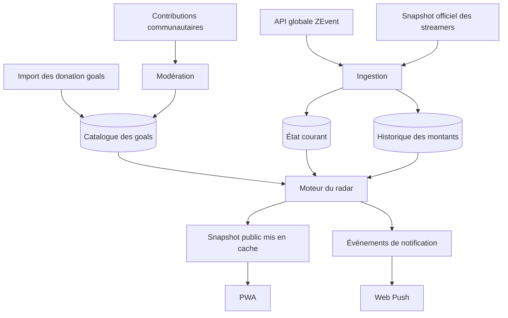

# Plan d’implémentation — Radar communautaire ZEvent

## 1. Vision produit

Créer le second écran communautaire du ZEvent permettant de répondre immédiatement à trois questions :

1. Quel donation goal est sur le point d’être atteint ?
2. Quel live mérite mon attention maintenant ?
3. Que se passe-t-il chez mes streamers favoris ?

### Proposition de valeur

> Le radar communautaire du ZEvent : les prochains donation goals à portée, les moments en cours et les alertes personnalisées, réunis dans une expérience mobile.

---

## 2. Sources de données

### API globale ZEvent

```http
GET https://api.zevent.fr/donation/current-amount
```

Utilisation :

- cagnotte globale ;
- actualisation très fréquente ;
- montant exprimé en euros.

Fréquence recommandée : 5 secondes avec cache serveur.

### Snapshot officiel ZEvent

```http
GET https://zevent.fr/api/app
```

Utilisation :

- liste des streamers ;
- cagnottes individuelles ;
- état du live ;
- viewers ;
- jeu courant ;
- avatars ;
- comptes Twitch ;
- liens officiels de don.

Fréquence recommandée : 15 secondes, avec requêtes conditionnelles basées sur `ETag`.

### Donation goals

Source initiale :

- export autorisé de l’InGDoc ;
- import JSON, CSV ou texte ;
- corrections et ajouts communautaires.

L’application conserve ensuite son propre catalogue de goals.

---

## 3. Stack technique

### Frontend

- React ;
- TypeScript ;
- Vite ;
- PWA ;
- service worker ;
- design mobile-first.

### Backend

- Hono ;
- Cloudflare Workers ;
- tâches planifiées ;
- API REST.

### Infrastructure

- Cloudflare D1 pour les données ;
- cache Cloudflare pour les snapshots publics ;
- Cloudflare Queues pour les notifications ;
- R2 pour les éventuelles captures ;
- Cloudflare Access pour l’administration ;
- Turnstile pour limiter le spam.

### Structure du projet

```text
apps/
  web/
  worker/

packages/
  contracts/
  radar-engine/
  ui/

data/
  initial-goals.json
```

---

## 4. Architecture



---

## 5. Modèle de données

### `streamers`

```text
id
twitch_id
twitch_login
display_name
profile_url
donation_url
online
game
viewers
amount_cents
last_seen_at
created_at
updated_at
```

### `goals`

```text
id
streamer_id
amount_cents
label
category
status
source_url
source_name
verified_at
reached_at
accomplished_at
created_at
updated_at
```

Statuts possibles :

```text
pending
verified
reached
accomplished
rejected
superseded
```

### `goal_versions`

```text
id
goal_id
amount_cents
label
category
source_url
changed_by
created_at
```

### `amount_snapshots`

```text
id
streamer_id
amount_cents
viewers
online
recorded_at
```

Enregistrer les changements de montant avec au minimum un point de contrôle toutes les cinq minutes.

### `community_reports`

```text
id
streamer_id
kind
message
source_url
status
installation_id
created_at
reviewed_at
reviewed_by
```

### `report_confirmations`

```text
report_id
installation_id
created_at
```

### `push_subscriptions`

```text
id
endpoint
p256dh
auth
installation_id
created_at
last_success_at
failure_count
```

### `notification_preferences`

```text
subscription_id
streamer_id
approaching_enabled
reached_enabled
accomplished_enabled
live_enabled
```

### `notification_deliveries`

```text
id
event_key
subscription_id
notification_type
sent_at
status
```

Ajouter une contrainte unique sur `event_key` et `subscription_id`.

### `moderation_audit`

```text
id
moderator_id
action
entity_type
entity_id
metadata
created_at
```

---

## 6. Normalisation des données

### Clé principale

Utiliser le Twitch ID :

```text
ZEvent : live[].twitch_id
Catalogue : streamer.twitch_id
```

Fallback :

```text
live[].twitch.toLowerCase()
```

Ne jamais joindre les données uniquement sur le nom affiché.

### Conversion monétaire

Les API officielles expriment les montants en euros.

```ts
const amountCents = Math.round(streamer.donationAmount.number * 100);
```

Le stockage et les calculs utilisent exclusivement des centimes entiers.

### Sources de vérité

```text
Cagnotte globale       → api.zevent.fr
Cagnottes individuelles → zevent.fr/api/app
Lives et viewers        → zevent.fr/api/app
Donation goals          → catalogue interne
Historique               → base interne
Goals accomplis          → modération
Moments en cours         → communauté
```

Ne pas forcer l’égalité entre la cagnotte globale et la somme des cagnottes individuelles.

---

## 7. Ingestion

### Montant global

- interroger la route globale toutes les cinq secondes ;
- mettre en cache pendant deux à cinq secondes ;
- conserver le dernier montant valide ;
- vérifier les valeurs numériques ;
- ne pas accepter une baisse importante sans confirmation.

### Streamers

- interroger `/api/app` toutes les quinze secondes ;
- utiliser `ETag` et `If-None-Match` ;
- valider la réponse avec Zod ;
- mettre à jour l’état courant ;
- créer un snapshot lorsqu’un montant change ;
- conserver le dernier snapshot valide si la source échoue.

### Résilience

- timeout court ;
- trois tentatives avec backoff ;
- circuit breaker ;
- cache stale-while-revalidate ;
- état de santé par source ;
- détection automatique des changements de schéma.

---

## 8. Import des donation goals

Formats acceptés :

- JSON ;
- CSV ;
- texte structuré ;
- saisie manuelle.

### Format canonique

```json
{
  "twitchLogin": "anyme023",
  "goals": [
    {
      "amount": 1500,
      "label": "Description du goal",
      "category": "donation",
      "sourceUrl": "https://..."
    }
  ]
}
```

### Pipeline d’import

1. Lire et valider le fichier.
2. Normaliser les comptes Twitch.
3. Retrouver les streamers officiels.
4. Convertir les euros en centimes.
5. Détecter les doublons.
6. Signaler les streamers introuvables.
7. Afficher un aperçu.
8. Demander une validation.
9. Créer ou mettre à jour les goals.
10. Enregistrer les anciennes valeurs dans `goal_versions`.

### Catégories

```text
donation
global
incentive
recurrent
donation_equal
donation_more_than
donation_largest
other
```

Seuls les goals financiers simples sont automatiquement comparés à la cagnotte individuelle.

---

## 9. Moteur du radar

### Prochain goal

```ts
const nextGoal = verifiedGoals
  .filter((goal) => goal.amountCents > streamer.amountCents)
  .sort((a, b) => a.amountCents - b.amountCents)[0];
```

### Montant restant

```ts
const remainingCents = nextGoal.amountCents - streamer.amountCents;
```

### Progression

```ts
const progress = streamer.amountCents / nextGoal.amountCents;
```

### Vitesse

Calculer les augmentations sur les cinq dernières minutes.

```text
vitesse = médiane des augmentations par minute
```

La médiane limite l’influence des dons exceptionnels.

### ETA

```text
ETA = montant restant / vitesse récente
```

Ne pas afficher d’ETA si :

- moins de trois échantillons sont disponibles ;
- la cagnotte ne progresse pas ;
- les données ont plus de deux minutes ;
- l’estimation dépasse une heure ;
- la volatilité est trop importante.

### Confiance

```text
Haute    → progression stable et données fraîches
Moyenne  → vitesse exploitable mais volatile
Faible   → peu d’échantillons ou fortes variations
```

### Score

```text
score =
  proximité financière
  × momentum
  × bonus live
  × confiance
  × fraîcheur
```

### Catégories affichées

```text
Imminent        ETA inférieure à 5 minutes
Très proche     moins de 10 % ou 2 000 €
En accélération vitesse fortement croissante
À surveiller    proche, mais estimation incertaine
```

---

## 10. Détection des paliers

Un palier est atteint lorsque :

```text
ancien montant < montant du goal
et
nouveau montant >= montant du goal
```

Cas particuliers :

- plusieurs paliers franchis entre deux mesures ;
- goal ajouté après avoir été atteint ;
- modification du montant d’un goal ;
- suppression d’un goal ;
- baisse temporaire de la cagnotte ;
- snapshot invalide ;
- événement calculé plusieurs fois.

Un goal ajouté sous le montant courant est marqué `reached` sans notification rétroactive.

---

## 11. Navigation

Navigation mobile principale :

```text
Radar
En direct
Favoris
Explorer
Communauté
```

Routes :

```text
/
 /radar
 /live
 /favorites
 /streamers
 /streamers/{login}
 /community
 /contribute
 /settings
 /status
 /about
```

---

## 12. Écrans

### Accueil/Radar

- cagnotte globale ;
- fraîcheur des données ;
- donation goals imminents ;
- goals récemment atteints ;
- moments communautaires ;
- émissions en cours ;
- recherche permanente.

### En direct

- streamers actuellement en live ;
- viewers ;
- jeu ;
- cagnotte ;
- prochain goal ;
- tri par popularité, proximité et momentum.

### Page streamer

- avatar et nom ;
- état du live ;
- viewers et jeu ;
- montant actuel ;
- courbe de progression ;
- vitesse récente ;
- prochain goal ;
- ETA et niveau de confiance ;
- liste complète des goals ;
- goals atteints et accomplis ;
- sources ;
- boutons `Regarder`, `Donner`, `Suivre` et `Signaler`.

### Favoris

- streamers suivis ;
- prochain goal ;
- évolution récente ;
- réglages de notifications ;
- résumé des événements manqués ;
- sélection partageable.

### Explorer

- recherche instantanée ;
- filtres live/hors ligne ;
- filtres sur place/à distance ;
- streamers avec ou sans goals ;
- goals à moins de 500 €, 1 000 €, 2 000 € ou 5 000 €.

### Communauté

- moments signalés ;
- goals en cours ;
- annonces importantes ;
- confirmations ;
- sources ;
- liens directs vers les lives.

### Réglages

- préférences de notifications ;
- mode nuit ;
- réduction des animations ;
- économie de données ;
- installation PWA ;
- gestion et suppression de l’abonnement.

### Administration

- état des sources ;
- retard d’ingestion ;
- import des goals ;
- modifications ;
- doublons ;
- modération ;
- goals accomplis ;
- erreurs de notifications ;
- journal d’audit.

---

## 13. Communauté

### Types de signalements

```text
goal_added
goal_updated
goal_accomplished
challenge_live
important_announcement
interesting_moment
data_error
```

### Formulaire

- streamer ;
- catégorie ;
- description courte ;
- URL source ;
- capture facultative.

### Validation

- propositions invisibles par défaut ;
- confirmation par plusieurs installations ;
- validation manuelle pour modifier un goal ;
- expiration des moments temporaires ;
- historique des décisions ;
- protection Turnstile ;
- limitation par installation et adresse réseau.

### Rôles

```text
viewer
trusted_contributor
```
