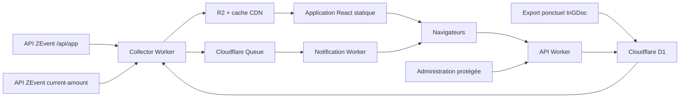

# Architecture technique et déploiement Cloudflare

## 1. Objectifs techniques

L’application doit être :

- rapide sur mobile et sur les connexions moyennes ;
- actualisée environ une fois par minute ;
- résistante à une hausse soudaine du trafic ;
- installable comme PWA ;
- capable d’envoyer des notifications Web Push ;
- exploitable gratuitement pendant le ZEvent ;
- indépendante de l’API InGDoc pendant son fonctionnement ;
- capable de continuer à afficher le dernier état connu si une API ZEvent devient temporairement indisponible.

Le projet privilégie une architecture statique et distribuée. Les visiteurs ne doivent pas déclencher une requête serveur ou une lecture de base de données à chaque rafraîchissement.

---

## 2. Stack retenue

### Frontend

- React 19.2
- TypeScript strict
- Vite
- React Router
- TanStack Query
- Tailwind CSS
- composants accessibles inspirés de shadcn/ui et Radix
- Lucide pour les icônes
- `vite-plugin-pwa`
- Vitest et Testing Library
- Playwright pour les parcours critiques

### Backend

- Cloudflare Workers
- Hono
- TypeScript
- validation légère des données entrantes
- Zod uniquement pour les formulaires et routes d’écriture
- Web Push avec clés VAPID

### Infrastructure

- Cloudflare Workers Static Assets
- Cloudflare Cron Triggers
- Cloudflare D1
- Cloudflare R2
- Cloudflare Queues
- Cloudflare Turnstile
- Cloudflare Access
- Cloudflare Analytics et Workers Logs

### Monorepo

```text
apps/
  web/
  api-worker/
  collector-worker/
  notification-worker/

packages/
  contracts/
  radar-engine/
  ui/

data/
  initial-goals.json

migrations/
```

Un workspace `pnpm` suffit. Turborepo n’est pas indispensable pour ce projet.

---

## 3. Architecture générale



Le chemin de lecture principal est :

```text
Navigateur → CDN Cloudflare → fichier JSON R2
```

Il ne passe ni par un Worker dynamique ni par D1.

---

## 4. Répartition des responsabilités

### `app.tondomaine.fr`

Contient :

- l’application React ;
- les fichiers CSS, JavaScript, polices et icônes ;
- les routes publiques de navigation ;
- les routes `/api/*` d’écriture et d’administration.

Les fichiers statiques sont servis directement par Cloudflare sans invoquer le Worker.

### `data.tondomaine.fr`

Contient les données publiques distribuées depuis R2 :

```text
/latest.json
/snapshots/{timestamp}.json
/goals.json
/status.json
```

Une règle Cloudflare doit explicitement rendre les fichiers JSON cacheables.

### Collector Worker

Exécuté toutes les minutes :

1. récupère les deux API officielles ;
2. vérifie les champs critiques ;
3. normalise les montants en centimes ;
4. fusionne les streamers avec le catalogue de goals ;
5. met à jour l’historique roulant ;
6. calcule les ETA et le classement du radar ;
7. détecte les franchissements de goals ;
8. publie le nouvel état dans R2 ;
9. place les événements de notification dans une Queue.

### API Worker

Gère uniquement :

- les contributions communautaires ;
- les confirmations ;
- les abonnements Web Push ;
- les préférences de notification ;
- les imports et actions de modération ;
- les routes d’administration ;
- l’état de santé détaillé.

### Notification Worker

Consomme les événements placés dans la Queue et :

- sélectionne les abonnements concernés ;
- applique les préférences ;
- vérifie les limites quotidiennes ;
- envoie les notifications par groupes ;
- supprime les abonnements expirés ;
- enregistre les livraisons ou erreurs pertinentes.

---

## 5. Structure des données publiques

### `latest.json`

Le fichier doit être directement utilisable par le frontend :

```ts
interface PublicState {
  generatedAt: string;
  sourceUpdatedAt: string;
  stale: boolean;

  event: {
    totalAmountCents: number;
    viewerCount: number;
  };

  streamers: PublicStreamer[];
  radar: RadarEntry[];
  recentEvents: PublicEvent[];
}
```

Chaque streamer contient uniquement les informations nécessaires à l’affichage :

```ts
interface PublicStreamer {
  id: string;
  twitchId: string;
  login: string;
  displayName: string;
  avatarUrl: string | null;
  online: boolean;
  game: string | null;
  viewers: number;
  amountCents: number;
  nextGoal: PublicGoal | null;
  velocityCentsPerMinute: number | null;
  etaSeconds: number | null;
  confidence: "high" | "medium" | "low" | null;
  updatedAt: string;
}
```

Les données privées suivantes ne doivent jamais apparaître dans ce fichier :

- abonnements Push ;
- clés Push ;
- identifiants de modération ;
- contributions en attente ;
- journaux internes ;
- données techniques d’administration.

---

## 6. Gestion des snapshots

Il ne faut pas enregistrer une ligne D1 par streamer et par minute.

Avec environ 338 streamers :

```text
338 × 1 440 minutes = 486 720 écritures quotidiennes
```

Le quota D1 gratuit est de 100 000 lignes écrites par jour.

### Stratégie retenue

À chaque collecte :

- écrire un seul snapshot public compact dans R2 ;
- mettre à jour `latest.json` ;
- conserver un historique roulant compact pour les calculs ;
- enregistrer dans D1 uniquement les événements significatifs.

Deux écritures R2 par minute représentent environ :

```text
2 × 1 440 × 30 = 86 400 écritures mensuelles
```

Cela reste largement sous le million d’opérations d’écriture inclus chaque mois.

### Conservation

- snapshots minute par minute : 7 jours maximum ;
- événements importants : conservation permanente ;
- données Push : suppression après le ZEvent ;
- journaux détaillés : conservation minimale ;
- règle automatique R2 pour supprimer les anciens snapshots.

---

## 7. Cache Cloudflare

### Fichiers compilés

Les fichiers portant un hash doivent recevoir :

```http
Cache-Control: public, max-age=31536000, immutable
```

Exemples :

```text
/assets/index-a81d2f.js
/assets/styles-92bde4.css
```

### Document HTML

```http
Cache-Control: public, max-age=0, must-revalidate
```

Cela évite qu’une ancienne version de l’application référence des fichiers supprimés.

### Données publiques

Pour `latest.json` :

```http
Cache-Control: public, max-age=15, stale-while-revalidate=120
```

Pour les snapshots versionnés :

```http
Cache-Control: public, max-age=31536000, immutable
```

### Configuration recommandée

- activer une règle de cache pour `data.tondomaine.fr/*.json` ;
- activer Smart Tiered Cache ;
- autoriser CORS depuis `app.tondomaine.fr` ;
- compresser les réponses avec Brotli ;
- exposer `ETag` et `Last-Modified` ;
- ne jamais ajouter de paramètre aléatoire aux URLs pour contourner le cache.

---

## 8. Optimisations frontend

### Chargement initial

Le premier écran doit charger uniquement :

- la navigation ;
- le montant global
